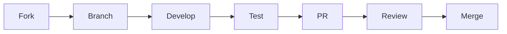

# Audit System

[](https://opensource.org/licenses/MIT)
[](https://www.typescriptlang.org/)
[](https://nodejs.org/)
[](https://www.terraform.io/)
[](https://aws.amazon.com/serverless/)
[](CONTRIBUTING.md)

<div align="center">
  
  
  A comprehensive audit system for tracking and managing system changes across your organization.
</div>

## 📋 Table of Contents

- [Features](#-features)
- [Architecture](#-architecture)
- [Project Structure](#-project-structure)
- [Getting Started](#-getting-started)
- [Testing](#-testing)
- [Monitoring](#-monitoring)
- [Security](#-security)
- [Documentation](#-documentation)
- [Contributing](#-contributing)
- [License](#-license)
- [Support](#-support)
- [Roadmap](#-roadmap)

## 🌟 Features

- **Real-time Event Processing**: Asynchronous processing of audit events using AWS Lambda
- **Secure Storage**: Encrypted storage with DynamoDB and automatic data cleanup
- **Advanced Querying**: Powerful API for retrieving and filtering audit logs
- **Comprehensive Monitoring**: Real-time metrics and alerts via CloudWatch
- **Role-based Access Control**: Fine-grained permissions using IAM
- **Data Retention**: Configurable TTL and retention policies
- **Audit Trail Visualization**: Modern React-based UI for log visualization

## 🏗️ Architecture

The system is built on AWS serverless architecture with the following components:

- **Frontend**: React application with Material-UI
- **API Layer**: API Gateway with custom authorizers
- **Processing**: SNS, SQS, and Lambda functions
- **Storage**: DynamoDB with TTL
- **Monitoring**: CloudWatch and SNS alerts

For detailed architecture diagrams and component descriptions, see [System Architecture](project/docs/system-diagram.md).

## 📁 Project Structure

```
audit-system/
├── project/                    # Main project directory
│   ├── src/                   # Source code
│   │   ├── api/              # API Gateway and backend services
│   │   ├── frontend/         # React application
│   │   ├── lambda/           # AWS Lambda functions
│   │   ├── shared/           # Shared code and utilities
│   │   └── utils/            # Utility functions
│   │
│   ├── terraform/            # Infrastructure as Code
│   │   ├── environments/     # Environment configurations
│   │   ├── modules/         # Reusable Terraform modules
│   │   └── shared/          # Shared Terraform configs
│   │
│   ├── config/              # Configuration files
│   ├── docs/                # Documentation
│   └── tests/               # Test suites
│
├── .github/                  # GitHub workflows and templates
├── scripts/                  # Build and deployment scripts
└── docs/                     # Project documentation
```

## 🚀 Getting Started

### Prerequisites

- Node.js >= 18.x
- AWS CLI configured with appropriate credentials
- Terraform >= 1.0.0
- PowerShell 7.x
- Git

### Quick Start

1. Clone the repository:
   ```powershell
   git clone https://github.com/your-org/audit-system.git
   Set-Location audit-system
   ```

2. Install dependencies:
   ```powershell
   npm install
   ```

3. Configure AWS credentials:
   ```powershell
   aws configure
   ```

4. Deploy the infrastructure:
   ```powershell
   Set-Location project/terraform/environments/dev
   terraform init
   terraform apply
   ```

5. Build and deploy the application:
   ```powershell
   npm run build
   npm run deploy
   ```

For detailed setup instructions, see [Deployment Guide](project/docs/deployment-guide.md).

## 🧪 Testing

The project includes comprehensive test coverage:

```powershell
# Run all tests
npm test

# Run specific test suites
npm run test:unit
npm run test:integration
npm run test:load
npm run test:security
```

## 📊 Monitoring

The system includes comprehensive monitoring:

- **CloudWatch Dashboards**: Real-time metrics and visualizations
- **Alarms**: Automated alerts for critical issues
- **Logging**: Structured logging for all components
- **Metrics**: Performance and usage metrics

## 🔒 Security

Security features include:

- **Authentication**: AWS IAM and Cognito
- **Authorization**: Custom authorizers and JWT validation
- **Encryption**: KMS for key management
- **Monitoring**: CloudTrail and GuardDuty integration

For detailed security information, see [Security Guide](project/docs/security-guide.md).

## 📚 Documentation

- [System Architecture](project/docs/system-diagram.md)
- [API Documentation](project/docs/api-documentation.md)
- [Deployment Guide](project/docs/deployment-guide.md)
- [Security Guide](project/docs/security-guide.md)
- [Contributing Guide](project/docs/contributing.md)

## 🤝 Contributing

We welcome contributions! Please see our [Contributing Guide](project/docs/contributing.md) for details.

1. Fork the repository
2. Create a feature branch
3. Make your changes
4. Run tests and linting
5. Submit a pull request

### Development Workflow



## 📝 License

This project is licensed under the MIT License - see the [LICENSE](LICENSE) file for details.

## 🆘 Support

For support:
1. Check the [documentation](project/docs/)
2. Search existing issues
3. Create a new issue if needed

## 🗺️ Roadmap

- [ ] Enhanced query capabilities
- [ ] Advanced analytics dashboard
- [ ] Machine learning for anomaly detection
- [ ] Multi-region deployment
- [ ] Enhanced security features

## 🙏 Acknowledgments

- AWS Serverless Architecture
- React and Material-UI
- Terraform Community
- Open Source Contributors

---

<div align="center">
  <sub>Built with ❤️ by the Audit System Team</sub>
</div> 