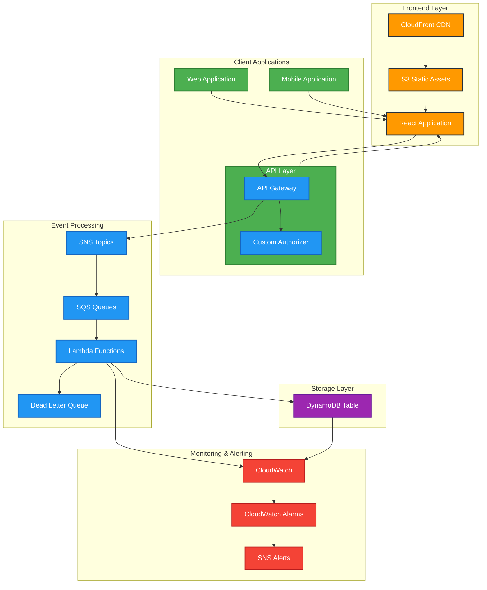
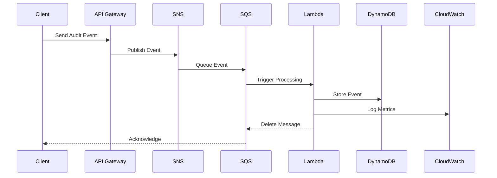
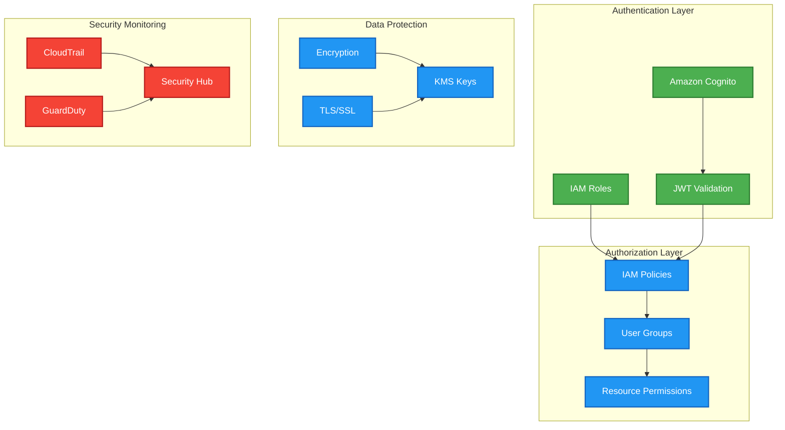

# Audit System Architecture Diagram

## High-Level System Architecture

## Event Processing Flow

## Security Architecture

## Component Descriptions

### Frontend Layer
- **React Application**: Main web interface for audit log visualization
- **CloudFront CDN**: Content delivery network for static assets
- **S3 Static Assets**: Storage for frontend static files

### API Layer
- **API Gateway**: REST API endpoint management
- **Custom Authorizer**: JWT token validation and authorization

### Event Processing
- **SNS Topics**: Event publishing and distribution
- **SQS Queues**: Event buffering and processing
- **Dead Letter Queue**: Failed event handling
- **Lambda Functions**: Event processing and storage

### Storage Layer
- **DynamoDB Table**: Audit event storage with TTL

### Monitoring & Alerting
- **CloudWatch**: Metrics and logging
- **CloudWatch Alarms**: Threshold monitoring
- **SNS Alerts**: Notification distribution

### Security Components
- **IAM Roles**: Service permissions
- **Amazon Cognito**: User authentication
- **JWT Validation**: Token verification
- **KMS**: Key management
- **CloudTrail**: API activity logging
- **GuardDuty**: Threat detection
- **Security Hub**: Security posture management 